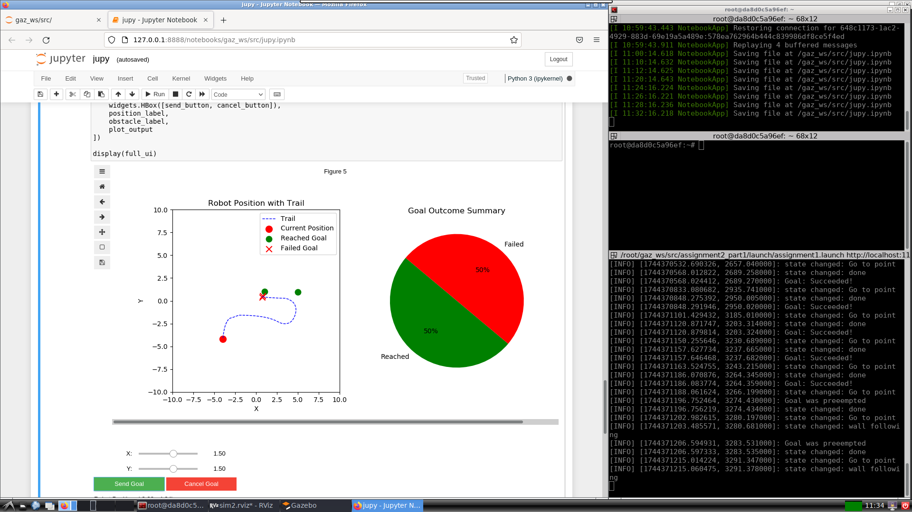

# Bug-0 and Wall-Following Robot Navigation in Gazebo with ROS Noetic

Full documentation available at [This Docs Link](https://milwd.github.io/gaz_ws/)

This project demonstrates a robot navigating in a Gazebo environment using the Bug-0 algorithm and a wall-following behavior. The navigation leverages an **Action Server** for non-blocking communication, allowing the user to cancel the robot's goal anytime. The project also provides the robot's previous goal destination through a service.


And a Jupyter Action-Server command center:


## Features
- **Action Server Navigation**: Users can input target coordinates (x, y), and the robot navigates to the location using the Bug-0 and wall-following algorithms.
- **Goal Cancellation**: The action server allows users to cancel the current goal at any time.
- **Service to Retrieve Last Goal**: The `/lastdestination` service returns the most recently set goal coordinates.
- **ROS Noetic Compatibility**: Built and tested with ROS Noetic and Gazebo.

## System Architecture
The system is composed of the following nodes and topics:

- **Nodes**:
  - `/robot_state_publisher`: Publishes the robot's joint states.
  - `/go_to_point` and `/wall_follower`: Implements the Bug-0 and wall-following algorithms.
  - `/bug_action_service`: Handles goal management through the Action Server.
  - `/userdestination`: Service for fetching the last goal set by the user.
- **Topics**:
  - `/cmd_vel`: Command velocity to control the robot's motion.
  - `/odom`: Provides odometry data.
  - `/reaching_goal/goal`: Sets a new goal for the robot.
  - `/reaching_goal/status`: Indicates the status of the robot's goal (reached, cancelled, etc.).

Refer to the RQT graph below for a detailed overview of the node connections:


## Prerequisites
- ROS Noetic
- Gazebo
- `rqt_graph` (for visualization)
- Necessary ROS packages for action servers, odometry, and geometry messages.

## How to Run

### Step 1: Launch the Gazebo Simulation
Run the Gazebo environment with the robot model:
```bash
roslaunch assignment1_part2 assignment1.launch
```    
Wait for RViz and Gazebo to start up!

### Step 2: Set a Goal
Input the goal coordinates via the terminal:
```bash
Set the goal coordinates!
Enter x coordinate: <value>
Enter y coordinate: <value>
Valid coordinate range: x ∈ [-9, 9], y ∈ [-9, 9].
```    

### Step 3: Cancel a Goal
While the robot is moving, press q and hit Enter to cancel the current goal.

### Step 4: Query the Last Goal
To retrieve the last goal, use the /lastdestination service:
```bash
rosservice call /lastdestination
```    
