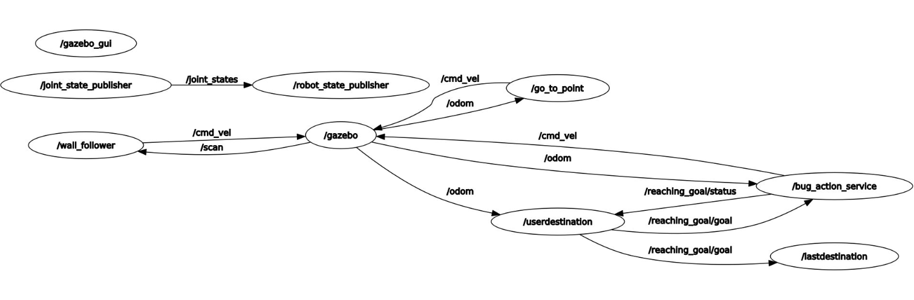

.. Wall Following with Gazebo and ROS documentation master file, created by
   sphinx-quickstart on Wed Mar 12 10:07:03 2025.
   You can adapt this file completely to your liking, but it should at least
   contain the root `toctree` directive.

Wall Following with Gazebo and ROS's documentation!
==============================================================

.. toctree::
   :maxdepth: 2
   :caption: Contents:
   
   docfiles/modules
   

Description
-----------
This project demonstrates a robot navigating in a Gazebo environment using the Bug-0 algorithm and a wall-following behavior, leveraging ROS Noetic and Gazebo for simulation. The robot can be controlled with an **Action Server** for non-blocking communication, allowing goal cancellation at any time. The system also includes a service to retrieve the most recently set goal destination.

.. image:: visu1.gif
   :alt: Bug-0 Robot Navigation in Gazebo
   :align: center

Features
--------
- **Action Server Navigation**: Navigate the robot to target coordinates (x, y) using Bug-0 and wall-following algorithms.
- **Goal Cancellation**: Cancel the current goal at any time through the action server.
- **Service to Retrieve Last Goal**: Access the most recent goal coordinates via the `/lastdestination` service.
- **ROS Noetic Compatibility**: Built and tested with ROS Noetic and Gazebo.

System Architecture
-------------------
The system includes the following nodes and topics:

**Nodes**:
- `/robot_state_publisher`: Publishes robot joint states.
- `/go_to_point` and `/wall_follower`: Implements the Bug-0 and wall-following algorithms.
- `/bug_action_service`: Manages goal-setting and cancellations via an Action Server.
- `/userdestination`: Provides the last goal set by the user.

**Topics**:
- `/cmd_vel`: Sends command velocity for robot motion.
- `/odom`: Provides odometry data.
- `/reaching_goal/goal`: Sets a new navigation goal for the robot.
- `/reaching_goal/status`: Indicates the status of the goal (reached, cancelled, etc.).



Prerequisites
-------------
Before running the project, ensure you have the following installed:
- ROS Noetic
- Gazebo
- `rqt_graph` (for visualization)
- Necessary ROS packages for action servers, odometry, and geometry messages.

How to Run
-----------
Follow these steps to run the robot simulation:

**Step 1: Launch the Gazebo Simulation**
Run the following command to start the Gazebo environment with the robot model:

```roslaunch assignment1_part2 assignment1.launch```


Run the Gazebo environment with the robot model:

roslaunch assignment1_part2 assignment1.launch
Wait for RViz and Gazebo to start up!

**Step 2: Set a Goal**
Input the goal coordinates via the terminal:

```Set the goal coordinates!```

```Enter x coordinate: <value>```

```Enter y coordinate: <value>```

```Valid coordinate range: x ? [-9, 9], y ? [-9, 9].```


**Step 3: Cancel a Goal**
While the robot is moving, press q and hit Enter to cancel the current goal.


**Step 4: Query the Last Goal**
To retrieve the last goal, use the /lastdestination service:

```rosservice call /lastdestination```

Indices and tables
==================

* :ref:`genindex`
* :ref:`modindex`
* :ref:`search`
